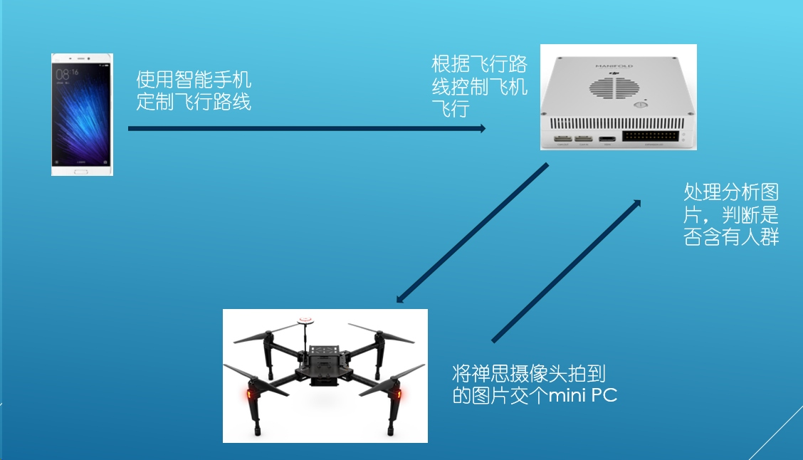

#基于DJI M100的人群检测
- 项目简介
- 项目开发环境
- [项目说明]
- 项目主要参考内容
- 完成度与待改进的地方
----------------------------------------------------
##项目简介
项目最终目的示意图

- 通过在手机上的APP规划一个二维的飞行路线（无人机飞行采取定高飞行），发送给远距离通信智能遥控器（官方宣称可以条件允许时，可以和无人机进行5公里远距离通信），智能遥控器再发送给无人机。
- 无人机接受到飞行路线信息后，将飞行路线信息传给搭载在无人机上的mini PC上，mini PC控制无人机飞控按照飞行路线进行飞行。
- 无人飞行过程中利用挂载在它上面的4K摄像头下方进行拍照采样，并将照片发送给mini PC。
- mini PC对照片进行处理，检测照片里是否存在人群，如果存在人群，则向手机发送一个检测到人群的信号 

项目组做该项目的目的并不仅仅是针对这一个系统，而是旨在搭建一套完整的体系，提供一套能够完成需要人的参与和无人机的自动飞行相结合的一种半自动化系统的模板，将智能手机-mini PC-无人机三者结合起来的，为以后其他类似的工作做准备。所以在项目具体实现时，代码会尽量模板化。

## 项目开发环境
####飞控逻辑
- OS:  windows7/8/8.1/10（后面会换成Ubuntu）
- IDE: QT 5.3
- dependency:  [onboard SDK 3.1](https://github.com/dji-sdk/Onboard-SDK)

####手机端
- OS: windows7/8
- IDE: Android Studio 1.5 +
- Android API level: 18 (官方说使用level 22+，但目前为止在level 18上的测试都没有问题)
- dependency: [moblie sdk android](https://github.com/dji-sdk/Mobile-SDK-Android)

####视觉
- OS: windows 8.1/10 (后面会换成Ubuntu)
- IDE: visual studio 2013
- dependency: opencv 2.48

 
##项目说明
目录                   | 说明
---                     | ---
flightControl    |  飞行控制程序
mobileAPP       |  手机端APP（现在只是个雏形）
vision                |  视觉模块

##项目主要参考内容
- [大疆官方mobile SDK教程](https://developer.dji.com/cn/mobile-sdk/documentation/introduction/index.html)
- [大疆官方onboard SDK教程](https://developer.dji.com/cn/onboard-sdk/documentation/quick-start/index.html)
- [大疆官方mobile sdk源码](https://github.com/dji-sdk/Mobile-SDK-Android)
- [大疆官方onboard sdk源码](https://github.com/dji-sdk/Onboard-SDK)
- [P.Dollar, C. Wojek,B. Schiele, et al. Pedestrian detection: an evaluation of the state of the art [J].IEEE Transactions on PatternAnalysis andMachine Intelligence, 2012, 34(4): 743-761.](https://www.computer.org/cms/ComputingNow/homepage/2012/0412/T_TP2_PedestrianDetection.pdf)
- [hog 特征](http://blog.csdn.net/liulina603/article/details/8291093)

##完成度和待改进的地方
####已完成
- 飞行控制程序架构基本完成，基于此，后继开发可以有更多精力关注飞行逻辑本身，而不必过多的关注环境和代码结构设计。
- 视觉直接使用opencv提供的hog+svm训练后的模型，进行识别
- 手机端APP和飞控程序间的通信完成

####未完成和待改进
- 飞行控制程序和视觉程序从windows移植到Ubuntu（mini PC）
- 视觉算法效率太低，远远无法达到实时性，需要改进
- 手机APP界面优化和传输数据大小有上限